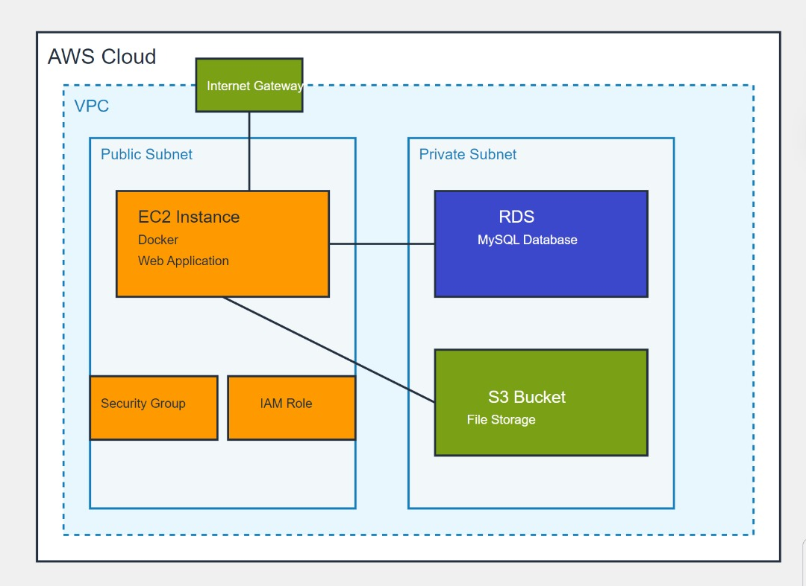

# EC2, RDS, and S3 Infrastructure with Docker

## Table of Contents
1. [Project Overview](#project-overview)
2. [Architecture](#architecture)
3. [Prerequisites](#prerequisites)
4. [Deployment Instructions](#deployment-instructions)
5. [Resources Created](#resources-created)
6. [Configuration Details](#configuration-details)
7. [Security Considerations](#security-considerations)
8. [Customization](#customization)
9. [Troubleshooting](#troubleshooting)
10. [Cleanup](#cleanup)
11. [Contributing](#contributing)

## Project Overview

This project uses AWS CloudFormation to deploy a robust infrastructure consisting of an EC2 instance running a Dockerized application, an RDS MySQL database, and an S3 bucket. The infrastructure is designed to support a Web Application hosted on the Docker Container with access to the RDS instance, and permissions to Upload, and Download files from an S3 Bucket.

## Architectural Diagram



## Architecture

The architecture includes the following components:

- **EC2 Instance**: Runs the Docker container with the application.
- **RDS MySQL Database**: Stores application data.
- **S3 Bucket**: Used for file storage and Image Upload.
- **Security Groups**: Control access to S3 Bucket, EC2 and RDS instances.
- **IAM Role and Instance Profile**: Grant necessary permissions to the EC2 instance.

## Prerequisites

Before deploying this infrastructure, ensure you have:

1. An AWS account with appropriate permissions.
2. AWS CLI installed and configured.
3. An existing EC2 KeyPair for SSH access.
4. Docker image of your application.

## Deployment Instructions

1. Clone this repository or download the CloudFormation template.

2. Deploy the stack using AWS CLI:
   ```
   aws cloudformation create-stack --stack-name my-app-stack --template-body file://temp.yaml --parameters ParameterKey=KeyName,ParameterValue=YourKeyPairName ParameterKey=DBPassword,ParameterValue=YourSecurePassword --capabilities CAPABILITY_IAM
   ```

3. Replace `YourKeyPairName` with your EC2 KeyPair name and `YourSecurePassword` with a secure database password.

4. Monitor the stack creation process in the AWS CloudFormation console.

## Resources Created

The CloudFormation template creates the following resources:

1. EC2 Instance (t2.medium by default)
2. RDS MySQL Instance (db.t3.medium by default)
3. S3 Bucket
4. IAM Role and Instance Profile
5. Security Groups for EC2 and RDS

## Configuration Details

### EC2 Instance
- **Instance Type**: t2.medium (configurable)
- **AMI**: Amazon Ubuntu (ami-0866a3c8686eaeeba)
- **User Data**: Installs Docker, Docker Compose, and runs the application container

### RDS Instance
- **Instance Class**: db.t3.medium (configurable)
- **Engine**: MySQL 8.0.39
- **Storage**: 20 GB (configurable)

### S3 Bucket
- Named automatically based on the stack name

### Security Groups
- EC2: Allows inbound traffic on ports 80, 8080, 443, 22, and 3306
- RDS: Allows inbound traffic on port 3306

## Security Considerations

1. The template uses a wide-open security group (0.0.0.0/0) for demonstration purposes. In production, restrict this to your specific IP or VPC.
2. SSH access (port 22) is open to all. Consider restricting this in production.
3. Database credentials are passed as parameters. Use AWS Secrets Manager for enhanced security.
4. Enable encryption for RDS and S3 in production environments.

## Customization

To customize the deployment:

1. Modify the `Parameters` section in the template to change instance types, database settings, etc.
2. Update the `UserData` section in the EC2 instance resource to use your own Docker image.
3. Adjust the IAM roles and policies as needed for your specific application requirements.

## Troubleshooting

1. **EC2 Instance Issues**:
   - Check the instance's system log in the EC2 console.
   - SSH into the instance and check `/var/log/cloud-init-output.log` for UserData script output.

2. **RDS Connection Issues**:
   - Verify security group rules.
   - Check if the RDS instance is publicly accessible (if intended).

3. **S3 Access Issues**:
   - Verify the IAM role permissions.
   - Check the S3 bucket policy.

## Cleanup

To avoid incurring further charges, delete the stack when you're done:

```
aws cloudformation delete-stack --stack-name my-app-stack
```

Note: This will delete all resources created by the stack, including the S3 bucket and its contents, and the RDS instance.

## Contributing

Contributions to improve the template or documentation are welcome. Please fork the repository and submit a pull request with your changes.

---

For any questions or issues, please open an issue in the project repository.